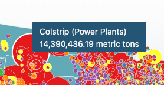

# Assignment 07: Final Project Proposal and more fun with D3.js

<!-- TOC -->

- [Assignment 07: Final Project Proposal and more fun with D3.js](#assignment-07-final-project-proposal-and-more-fun-with-d3js)
    - [Part I: Complete lesson map (5 pts)](#part-i-complete-lesson-map-5-pts)
    - [Part II: Final project proposal (5 pts)](#part-ii-final-project-proposal-5-pts)
        - [Updated content from assignment 06](#updated-content-from-assignment-06)
        - [New content](#new-content)
            - [Anticipating your technology stack](#anticipating-your-technology-stack)

<!-- /TOC -->

## Part I: Complete lesson map (5 pts)

Finish the assignment as outlined in the lesson, using the US states and the facility emissions data. Complete the following requirements in addition to the lesson instructions:

1. Map includes a tooltip allowing the user to retrieve specific information about each facility, minimally including the name of the facility and a well-formatted output of the total metric tons of greenhouse gas emissions reported. Hint: use the tooltip example from the previous module as a starting point.     
  
*Tooltip example.*     
2. Update map title, author, and replace the filler text with a statement or two about the map and data.
3. Explore different color schemes and symbology styles for the facility layer, state layer, and UI elements. Don't worry about finding a 'correct' representation; instead, experiment with the various ways to change the appearance of your map layers and UI. 

Commit your changes as you work and push the remote repository for help and final submission. Be sure to format your code with proper indentation before you submit.

## Part II: Final project proposal (5 pts)

Submit a 1-2 page written project proposal that includes:

### Updated content from assignment 06

* description of data topic (with an anticipated map title)
* map objectives
* user needs, articulated through a persona/scenario
* data sources
* any updated specific feedback from your instructor

### New content

* identify your anticipated methods of thematic representation methods (e.g., dot map, choropleth, prop symbols, etc.)
* briefly describe your anticipated user interface (UI)
* provide a series of low fidelity wireframes, paper prototypes, or mockups (in addition to the 1-2 pages)
* outline your "technology stack" (see below)

Please submit this proposal in the Markdown format. However, ensure spelling and grammar are correct (you can paste Markdown into a spelling checker, or search for spelling plugins for your text editor of choice).

#### Anticipating your technology stack

While your answer to this question need not be definite at this point, briefly describe the "technology stack" you plan to use for your final map. Your description of the technology stack should include:

* data and information processing tools, web-based or desktop (i.e., QGIS, [MapShaper](http://www.mapshaper.org/))
* the format you'll use to store your data (i.e., flat files such as CSV or GeoJSON, database technology such as CARTO)
* the JS libraries you anticipate using or need (include any relevant plugins, lik omnivore)
* other relevant web technologies you'll be using (i.e., HTML, CSS)
* the hosting platform you intend to use to host your map (i.e., GitHub pages, your web server, [http://surge.sh/](http://surge.sh/))

Note: This is a draft of the information we'll want to include in your final map project. While informative to curious users of your map, the proposal also looks good to employers and clients in terms of demonstrating your expertise in the world of open source web mapping!